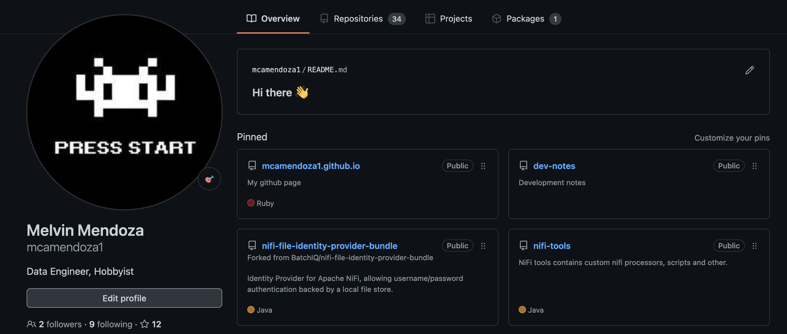
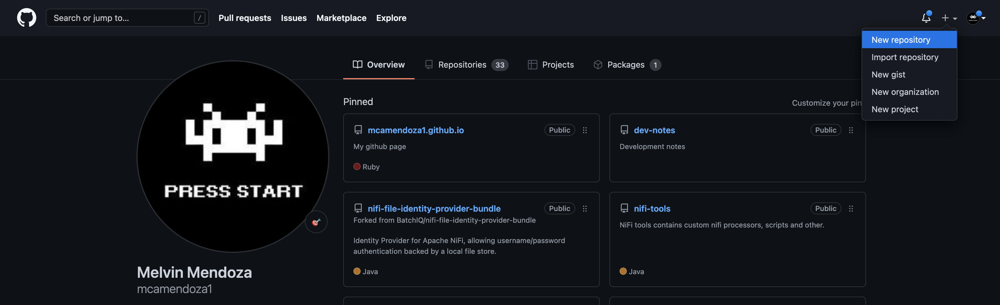
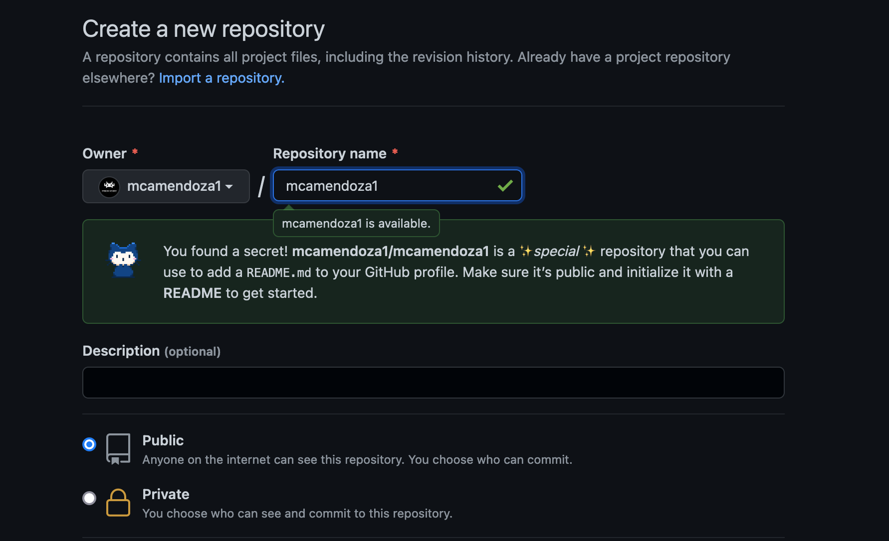
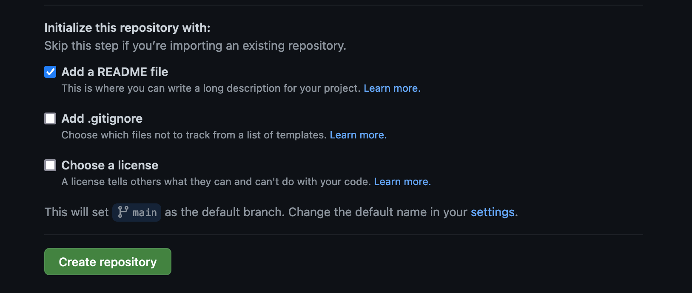
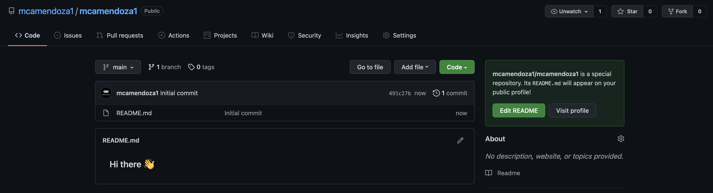

# How to create Github Profile README

A special repo that will appear on public profile

 

## Steps

1. Create new public repository. 
   
     

2. Reposity name should be the same as your username
   
     

3. Check the `Add a README file`
   
     

4. Viola! it should be reflected on your profile.
     
 
